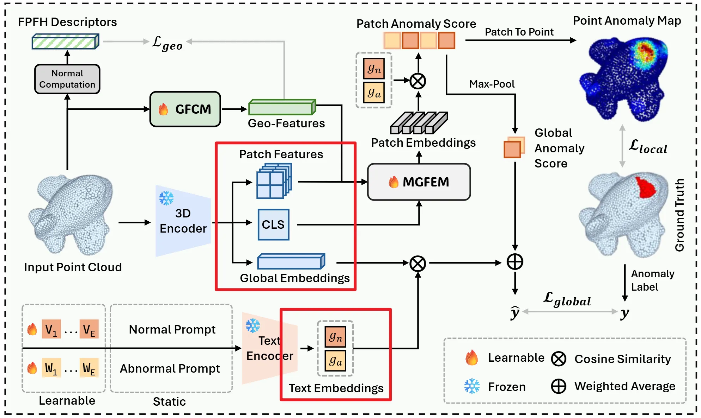


# Back to Point: Exploring Point-Language Models for Zero-Shot 3D Anomaly Detection

# Notes
We are still extending our experiments, so we are not able to release the full codebase at this stage. Instead, we provide a minimal working example that applies a simple linear projection to map ULIP patch features into a channel space aligned with the text embeddings. This release is intended to help researchers quickly build upon ULIP-based 3D anomaly detection frameworks and explore more pioneering directions.

# Quick Start
## Installation
```
conda create -n BTP python=3.10 -y
conda activate BTP
git clone https://github.com/wistful-8029/BTP-3DAD.git
pip install -r requirements.txt
```
## Data Preparation

Download the datasets from [Real3D-AD](https://drive.google.com/file/d/1oM4qjhlIMsQc_wiFIFIVBvuuR8nyk2k0/view?usp=sharing) and [Anomaly-ShapeNet](https://huggingface.co/datasets/Chopper233/Anomaly-ShapeNet).

After downloading, organize the raw data as follows (example for Real3D-AD):

```text
data/
└── real3dad/
    ├── airplane/
    │   ├── train/
    │   │   ├── 1_prototype.pcd
    │   │   ├── 2_prototype.pcd
    │   │   └── ...
    │   ├── test/
    │   │   ├── 1_bulge.pcd
    │   │   ├── 2_sink.pcd
    │   │   └── ...
    │   └── gt/
    │       ├── 1_bulge.txt
    │       ├── 2_sink.txt
    │       └── ...
    ├── car/
    └── ...
```
### Data Preprocessing
We preprocess the raw point clouds by uniformly sampling each shape to 2048 points.
```
python utils/processing_real3d.py \
  --raw_root /path/to/data/real3dad \
  --out_root /path/to/data/Real3D-AD-2048 \
  --num_samples 2048
```
The processed dataset will be saved as:
```
data/
└── Real3D-AD-2048/
    ├── airplane/
    │   ├── train/
    │   │   ├── 60_template.npy
    │   │   ├── 128_template.npy
    │   │   └── ...
    │   ├── test/
    │   │   ├── 67_good.npy
    │   │   ├── 67_good_cut.npy
    │   │   └── ...
    ├── car/
    └── ...
```
## Pretrained Models

Download the pretrained weights below and place them under `pretrained/`:

- [open_clip_pytorch_model.bin](https://huggingface.co/laion/CLIP-ViT-bigG-14-laion2B-39B-b160k/blob/main/open_clip_pytorch_model.bin)
- [ULIP-2-PointBERT-10k-xyzrgb-pc-vit_g-objaverse_shapenet-pretrained.pt](https://huggingface.co/datasets/SFXX/ulip/blob/main/ULIP-2/pretrained_models/ULIP-2-PointBERT-10k-xyzrgb-pc-vit_g-objaverse_shapenet-pretrained.pt)
```
BTP-3DAD/
└── pretrained/
    ├── open_clip_pytorch_model.bin
    └── ULIP-2-PointBERT-10k-xyzrgb-pc-vit_g-objaverse_shapenet-pretrained.pt
```
## Run
```
python min_baseline.py  --data_root /path/to/Real3D-AD-2048
```
Example output：
```
ULIP text encoding (normal): shape=(1280,)
ULIP text encoding (anomaly): shape=(1280,)

Point cloud input: shape=(8, 2048, 3)
ULIP global_embedding: shape=(8, 384)
ULIP intermediate patch_idx: shape=(8, 512, 32)
ULIP intermediate layer_feats[2]: shape=(8, 513, 384)
ULIP intermediate layer_feats[5]: shape=(8, 513, 384)
ULIP intermediate layer_feats[8]: shape=(8, 513, 384)
ULIP intermediate layer_feats[11]: shape=(8, 513, 384)
ULIP cls_feature: shape=(8, 384)
ULIP patch_features (without CLS): shape=(8, 512, 384)
Adapter patch_features: shape=(8, 512, 1280)
```
The above outputs correspond to the variables highlighted in the red boxes in the figure below. With these intermediate features (text embeddings, global/CLS features, and patch-level features), one can build a ULIP-based pipeline for 3D anomaly detection. We will release our full implementation in the near future.

# Citation
